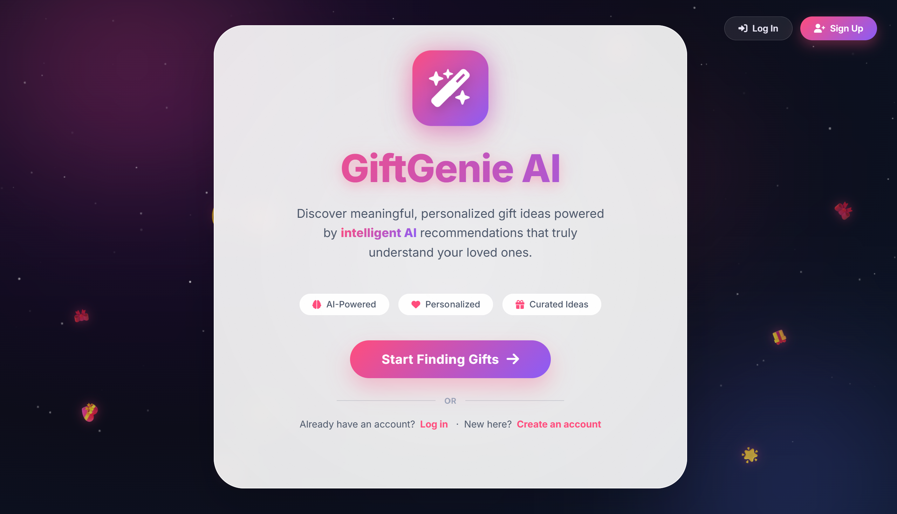
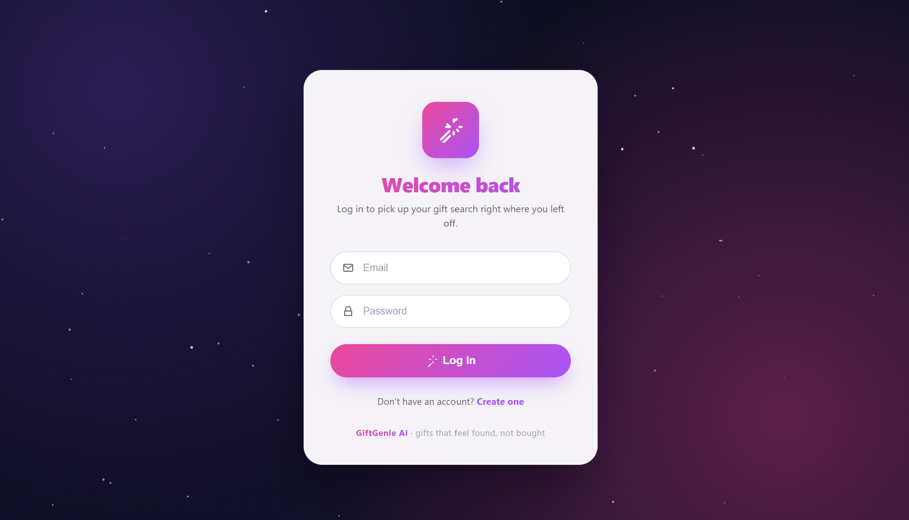
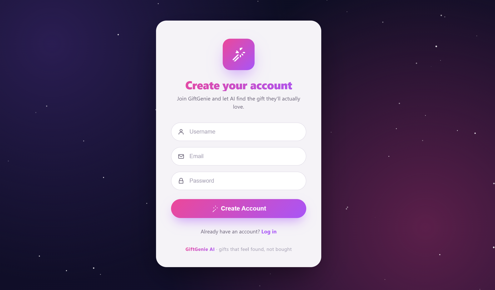
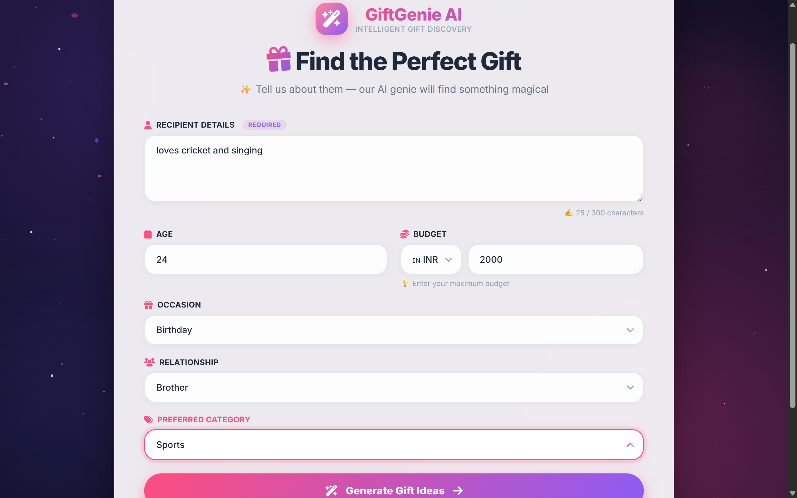
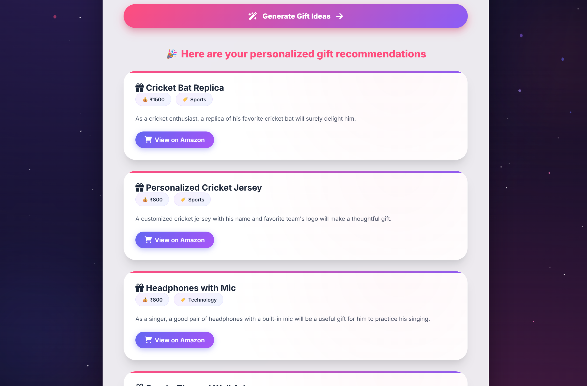
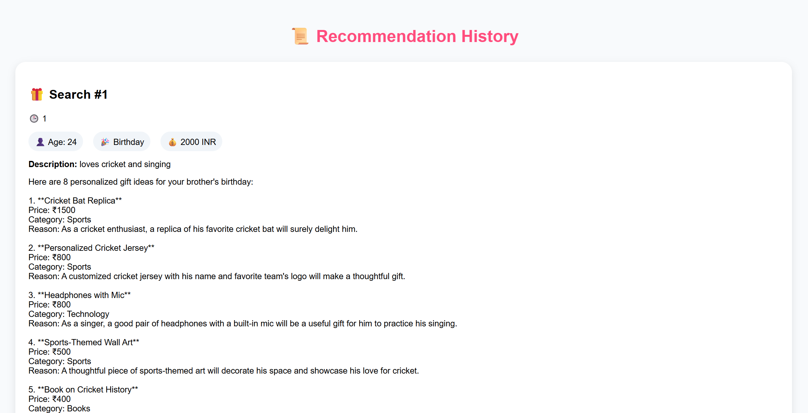

# 🎁 GiftGenie AI

GiftGenie AI is an AI-powered personalized gift recommendation platform that helps users discover thoughtful gifts based on a recipient's personality, interests, relationship, occasion, and budget.

The application leverages Large Language Models (LLMs) through OpenRouter to generate intelligent gift suggestions and provides users with a clean, interactive experience for gift discovery.

## 🌐 Live Demo

https://the-gift-genie-fr43.onrender.com/

---

## ✨ Features

### 🤖 AI-Powered Gift Recommendations

* Generates personalized gift ideas using LLMs.
* Understands recipient interests, hobbies, personality traits, and preferences.
* Provides recommendations tailored to the user's budget.

### 🎯 Smart Personalization

* Age-based recommendations.
* Occasion-aware suggestions.
* Relationship-specific gifting ideas.
* Category filtering for focused recommendations.

### 💰 Budget Optimization

* Supports multiple budget ranges.
* Currency-aware gift generation.
* Prioritizes practical and relevant suggestions.

### 🛒 Product Discovery

* Generates direct Amazon search links for suggested gifts.
* Helps users quickly explore products online.

### 👤 User Authentication

* User registration and login system.
* Session-based authentication.
* Personalized recommendation history.

### 📜 Recommendation History

* Stores previous recommendations in SQLite.
* Timestamped recommendation records.
* User-specific history tracking.

### 🎨 Modern User Interface

* Responsive design.
* Gradient-based modern UI.
* Animated elements and interactive components.
* Mobile-friendly experience.

---

## 🏗️ System Architecture

User Input
↓
Flask Backend
↓
Prompt Engineering
↓
OpenRouter API
↓
Llama 3 Model
↓
AI Gift Recommendations
↓
SQLite Storage
↓
Recommendation History

---

## 🛠️ Tech Stack

### Frontend

* HTML5
* CSS3
* JavaScript
* Font Awesome

### Backend

* Python
* Flask

### Database

* SQLite

### AI / Generative AI

* OpenRouter API
* Meta Llama 3 8B Instruct

### Deployment

* Render

---

## 📂 Project Structure

GiftGenie-AI/

├── app.py

├── giftgenie.db

├── requirements.txt

├── .env

├── templates/

│   ├── index.html

│   ├── form.html

│   ├── login.html

│   ├── register.html

│   └── history.html

├── static/

│   ├── css/

│   ├── js/

│   └── images/

└── README.md

---

## 🚀 Installation

### Clone Repository

```bash
git clone https://github.com/gurleen26/the_gift_genie.git

cd the_gift_genie
```

### Create Virtual Environment

```bash
python -m venv venv
```

### Activate Environment

Windows:

```bash
venv\Scripts\activate
```

Linux/Mac:

```bash
source venv/bin/activate
```

### Install Dependencies

```bash
pip install -r requirements.txt
```

### Configure Environment Variables

Create a `.env` file:

```env
OPENROUTER_API_KEY=your_api_key_here
```

### Run Application

```bash
python app.py
```

Open:

```text
http://127.0.0.1:5000
```

---

## 🔮 Future Enhancements

* Password hashing with Werkzeug Security.
* Wishlist and Favorites functionality.
* Amazon Product API integration.
* Semantic search using FAISS.
* Recommendation refinement through feedback loops.
* User preference profiling.
* Recommendation analytics dashboard.
* Multi-LLM support.

---

## 📸 Screenshots

### 🏠 Landing Page



---

### 🔐 Login Page



---

### 📝 Register Page



---

### 🎁 Gift Recommendation Form



---

### 🤖 AI Recommendations



---

### 📜 Recommendation History


---

## 🎯 Learning Outcomes

Through this project, I gained hands-on experience in:

* Prompt Engineering
* LLM Integration
* Flask Web Development
* REST API Consumption
* SQLite Database Design
* User Authentication
* Session Management
* Frontend UI Design
* Cloud Deployment using Render

---

## 👨‍💻 Author

Gurleen Kaur

GitHub:
https://github.com/gurleen26

Project Repository:
https://github.com/gurleen26/the_gift_genie

Live Application:
https://the-gift-genie-fr43.onrender.com/

---

⭐ If you found this project useful, consider giving it a star on GitHub.
